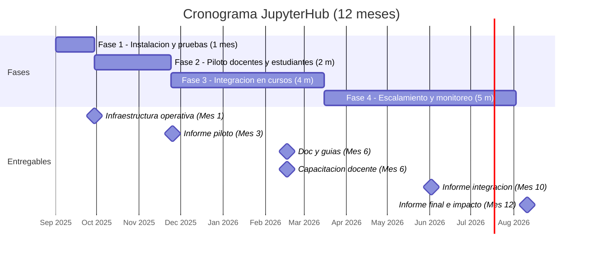

# Propuesta Técnica - Plataforma JupyterHub para docencia e investigación – Universidad EIA

**Universidad EIA**  
**Fecha:** 31 de julio de 2025  
**Coordinador del proyecto:** Jaime Alberto Sánchez Velásquez

---

## 1. CONDICIONES DE USO Y LICENCIA

Este proyecto se desarrolla bajo un enfoque de ciencia abierta y transparencia académica. La propuesta, así como los scripts y documentos asociados, se publican en un repositorio público de GitHub con fines educativos e investigativos, permitiendo su consulta y reutilización por parte de la comunidad.

El proyecto cuenta con el apoyo de Google Cloud Research Credits por un valor de USD 5,000, otorgados directamente a la Universidad EIA. El uso de estos créditos se rige por los términos de servicio de Google Cloud Platform y las condiciones específicas del programa Google Cloud Research Credits, los cuales establecen que los recursos deben destinarse exclusivamente a actividades de investigación y docencia, sin posibilidad de transferencia ni reventa.

Los resultados y configuraciones derivados del uso de estos recursos se comparten de manera abierta, sin comprometer la propiedad intelectual de Google ni de la Universidad EIA. El repositorio se distribuye bajo la licencia [MIT](https://opensource.org/licenses/MIT), garantizando libertad de uso, modificación y redistribución, siempre que se mantenga la atribución correspondiente.

---

## 2. INTRODUCCIÓN

El acceso equitativo y escalable a recursos computacionales es un desafío crítico en la formación moderna de ingenieros y científicos. La enseñanza de lenguajes como Python, R y Julia para análisis de datos, simulación, optimización o aprendizaje automático requiere ambientes interactivos, reproducibles y accesibles. Sin embargo, muchas instituciones enfrentan limitaciones técnicas y económicas para proveer este tipo de infraestructura de manera sostenible.

La Universidad EIA reconoce la importancia de contar con plataformas que fortalezcan los procesos de enseñanza y aprendizaje, al tiempo que potencien el desarrollo de proyectos de investigación y extensión. En este contexto, se propone el despliegue de una plataforma educativa basada en JupyterHub sobre Google Cloud, orientada a apoyar la docencia, la extensión, la investigación y los proyectos estudiantiles en la Facultad de Ingeniería y Ciencias Básicas.

La infraestructura propuesta permitirá ofrecer ambientes de trabajo en notebooks con múltiples lenguajes (Python, R y Julia), acceso vía web desde cualquier lugar, almacenamiento persistente por usuario, control de acceso y capacidad de escalar dinámicamente según la demanda. Además, facilitará la integración de buenas prácticas de ciencia abierta y reproducible, contribuyendo a la formación de competencias digitales en estudiantes y docentes.

Finalmente, gracias al respaldo del programa Google Cloud Research Credits, con una asignación de USD $5000, la Universidad EIA contará con los recursos necesarios para implementar, probar y evaluar esta solución en un entorno real, sin incurrir en costos adicionales para la institución durante la fase inicial. Esto permitirá generar evidencia técnica y pedagógica que respalde su adopción a largo plazo.

---

## 3. JUSTIFICACIÓN

El proyecto propuesto busca el **despliegue de un entorno gestionado de JupyterHub** sobre infraestructura de Google Cloud, orientado a soportar actividades de enseñanza, investigación y desarrollo en la Facultad de Ingeniería y Ciencias Básicas de la Universidad EIA. La plataforma permitirá el acceso equitativo y escalable a recursos computacionales avanzados para análisis de datos, simulación, modelado y experimentación en múltiples disciplinas, incluyendo estadística, optimización, inteligencia artificial y energías renovables.

Este enfoque **cumple con los criterios propios de un proyecto de investigación aplicada**, dado que:

1.	**Validez científica y técnica reconocida externamente:**
El proyecto fue evaluado y aceptado dentro del programa Google Cloud Research Credits, el cual otorga recursos exclusivamente a iniciativas con mérito científico, potencial de impacto y solidez técnica. Esto constituye un aval externo de su carácter investigativo.

2.	**Generación de nuevo conocimiento y desarrollo tecnológico:**
La implementación y personalización de un clúster JupyterHub sobre Google Kubernetes Engine con almacenamiento persistente, autenticación segura y escalabilidad controlada implica la investigación, experimentación y documentación de arquitecturas avanzadas de cómputo en la nube. El resultado será un prototipo funcional y documentado, susceptible de ser replicado y escalado.

3.	**Impacto académico y social:**
La plataforma permitirá que estudiantes y docentes realicen actividades que, de otra forma, requerirían costosas infraestructuras locales, favoreciendo la investigación colaborativa, la reproducibilidad científica y la integración de herramientas de código abierto. Esto fortalece las capacidades de investigación de la universidad y amplía su alcance en proyectos con la industria y otras instituciones académicas.

4.	**Metodología estructurada de I+D:**
El proyecto se desarrollará en fases (configuración inicial, piloto, integración en cursos, despliegue institucional) con entregables medibles y documentados, siguiendo buenas prácticas de ingeniería de software, gestión de proyectos y evaluación de resultados.

5.	**Potencial de transferencia y sostenibilidad:**
La experiencia adquirida permitirá diseñar guías y casos de uso que puedan ser transferidos a otros programas académicos y semilleros, así como escalar la infraestructura para atender proyectos de mayor envergadura o cooperación internacional.

Aunque la fase inicial se soporta con los créditos de Google Cloud Research, la propuesta contempla mecanismos que aseguren la continuidad del proyecto más allá de su vigencia. Entre ellos se incluyen: (1) la articulación con convocatorias de investigación e innovación (MinCiencias, ICETEX, cooperación internacional) que respalden el escalamiento de la infraestructura; (2) la migración parcial o total hacia servidores propios de la Universidad EIA, aprovechando las capacidades disponibles en el campus; y (3) la exploración de un modelo híbrido de operación que combine recursos en la nube con infraestructura institucional, optimizando costos y asegurando escalabilidad. Con ello se garantiza que la plataforma no solo tenga impacto inmediato, sino que se consolide como un recurso estratégico para docencia, investigación y extensión en el mediano y largo plazo.
En conclusión, el aval obtenido por parte de Google, junto con la metodología y objetivos planteados, evidencian que este no es un simple proyecto operativo o administrativo, sino una iniciativa de investigación aplicada en el campo de las infraestructuras digitales para educación e innovación.

---

## 4. OBJETIVO GENERAL

Diseñar e implementar una infraestructura educativa en la nube, basada en JupyterHub, que proporcione acceso a ambientes interactivos de desarrollo y análisis para estudiantes y docentes de la Universidad EIA, apoyando procesos de **docencia, investigación y extensión**, y optimizando el uso de créditos de Google Cloud.  

---

## 5. OBJETIVOS ESPECÍFICOS

- Implementar un clúster Kubernetes administrado en Google Cloud que hospede JupyterHub con soporte multiusuario.  
- Configurar el control de acceso, el almacenamiento persistente y los entornos base con Python, R y Julia, asegurando reproducibilidad científica.  
- Fortalecer la **docencia** mediante la capacitación de docentes en el uso de la plataforma y la integración en cursos de la Facultad.  
- Favorecer la **investigación** al habilitar entornos de análisis colaborativo y experimentación reproducible.  
- Impulsar la **extensión** mediante el soporte a semilleros y proyectos estudiantiles con alcance externo a la universidad.  
- Monitorear y optimizar el uso de recursos en función de la demanda académica y de investigación.  
- Garantizar la sostenibilidad técnica y operativa del sistema durante la fase inicial (12 meses con presupuesto de USD 5000) y establecer mecanismos para su continuidad posterior.  

---

## 6. EQUIPO DE TRABAJO

| Nombre                          | Institución     | Rol en el proyecto       | Responsabilidad asignada                                  |
|---------------------------------|-----------------|--------------------------|----------------------------------------------------------|
| Jaime Alberto Sánchez Velásquez | Universidad EIA | Coordinador del proyecto | Diseño, despliegue técnico, operación y soporte de la plataforma |
| Dubán Alberto Gómez Betancur    | Universidad EIA | Coordinador del proyecto | Acompañamiento académico y apoyo en la integración curricular |
| Juan Sebastián Valencia Villa   | Universidad EIA | Coordinador del proyecto | Acompañamiento académico y apoyo en la integración curricular |
| Adriana M. Quinchía Figueroa    | Universidad EIA | Dirección I+D            | Acompañamiento estratégico y validación de resultados    |

---

## 7. DURACIÓN

**1 año** (agosto 2025 – julio 2026)

---

## 8. METODOLOGÍA  

El proyecto se desarrollará en cuatro fases:  

**Fase 1: Instalación y pruebas iniciales (1 mes)**  
- Configuración básica de JupyterHub en Google Cloud (GCP), autenticación y despliegue técnico inicial.  
- Validación del entorno multiusuario con ejemplos de Python, R y Julia.  

**Fase 2: Prueba piloto con docentes y estudiantes seleccionados (2 meses)**  
- Recolección de retroalimentación técnica y pedagógica.  
- Ajustes de configuración según necesidades de docencia e investigación.  

**Fase 3: Integración progresiva en cursos académicos (4 meses)**  
- Formación de docentes y acompañamiento para integrar la plataforma en cursos de la Facultad.  
- Uso de la plataforma en proyectos de investigación estudiantil y semilleros.  

**Fase 4: Escalamiento institucional, extensión y monitoreo (5 meses)**  
- Integración con más programas y asignaturas a nivel institucional.  
- Soporte a actividades de extensión (proyectos con industria y comunidad académica externa).  
- Seguimiento de uso, análisis de métricas y plan de sostenibilidad posterior al primer año.  

---

## 9. ENTREGABLES Y CRONOGRAMA

### Entregables

1. **Infraestructura desplegada y operativa** (Mes 1)  
   - Incluye autenticación, configuración inicial de entornos (Python, R, Julia) y validación multiusuario.  

2. **Informe de prueba piloto con docentes y estudiantes** (Mes 3)  
   - Resultados técnicos y pedagógicos iniciales.  

3. **Documentación técnica, manual de usuario y guías de buenas prácticas** (Mes 6)  
   - Guías orientadas a docencia, investigación y semilleros.  

4. **Capacitación docente y acompañamiento en primeros cursos** (Mes 6)  
   - Formación inicial + integración práctica en asignaturas piloto.  

5. **Informe de integración en cursos académicos y semilleros** (Mes 10)  
   - Evidencia del uso en docencia, investigación y proyectos de extensión.  

6. **Informe final de uso, impacto, sostenibilidad y recomendaciones** (Mes 12)  
   - Incluye plan de continuidad más allá del primer año.  

---

### Cronograma (visual)

---

## 10. VALOR Y FORMA DE FINANCIACIÓN

El valor de la propuesta incluye el uso de créditos por **USD $5,000** otorgados por **Google Cloud Research Credits**, con los cuales se implementará una arquitectura sostenible que garantice el funcionamiento continuo de JupyterHub durante 12 meses. Adicionalmente, el proyecto contempla mecanismos de sostenibilidad que permitan dar continuidad al servicio más allá del periodo financiado por Google Cloud, mediante infraestructura institucional o convocatorias externas.

La solución contempla el despliegue sobre **Google Kubernetes Engine (GKE)** bajo un esquema de recursos optimizados, incluyendo autenticación web, almacenamiento persistente por usuario y entornos de programación en **Python**, **R** y **Julia**.

### Forma de uso y asignación de recursos

- Hasta **50 usuarios activos simultáneamente**, más de 100 usuarios registrados.
- Entornos personalizados por curso con bibliotecas científicas y de análisis de datos.
- Almacenamiento individual de hasta **10 GB por usuario** en Cloud Storage.
- Uso de CPU por defecto, con posibilidad de acceso a GPU bajo demanda para proyectos docentes o de investigación.
- Acceso web seguro con autenticación mediante `FirstUseAuthenticator` o `NativeAuthenticator`.
- Infraestructura **autoescalable** para balancear el uso y controlar los costos.

> **Nota técnica:** Se prioriza la sostenibilidad del entorno con recursos compartidos, limitando el uso intensivo de cómputo para deep learning o simulaciones pesadas. El entorno es ideal para cursos de programación, análisis de datos, estadística, optimización y simulación.

---

## 11. TÉRMINOS Y CONDICIONES

- Google Cloud cubre hasta USD 5000 en créditos no renovables.  
- El servidor será monitoreado para asegurar la eficiencia en el consumo de recursos.  
- Los resultados del proyecto podrán ser compartidos en eventos académicos y publicaciones, respetando la política de uso de la Universidad EIA.

---

## 12. PLAN DE SEGUIMIENTO Y JUSTIFICACIÓN PARA SOLICITUD DE AMPLIACIÓN DE CRÉDITOS

**Nombre del proyecto:** Plataforma JupyterHub para docencia e investigación – Universidad EIA  
**ID del proyecto en GCP:** _[coloca aquí tu ID del proyecto]_  
**Duración estimada:** 12 meses  
**Solicitante:** Jaime Sánchez Velásquez – Profesor investigador, Escuela de Ingeniería y Ciencias Básicas, Universidad EIA

### Objetivo del seguimiento

Establecer mecanismos de monitoreo y evaluación del uso de la infraestructura en Google Cloud para garantizar:
- Uso responsable y eficiente de los créditos
- Evidencia del impacto educativo y científico
- Base sólida para solicitar una extensión de créditos si es necesario

### Indicadores clave de seguimiento (KPI)

| Indicador                       | Frecuencia         | Fuente/Herramienta               |
|--------------------------------|--------------------|----------------------------------|
| Créditos consumidos            | Semanal            | Google Cloud Billing Dashboard   |
| Usuarios registrados           | Mensual            | Dashboard de JupyterHub          |
| Usuarios simultáneos           | Semanal            | Logs / métricas de GKE           |
| Cursos integrados              | Trimestral         | Coordinación académica           |
| Tiempo promedio de sesión      | Mensual            | Logs de uso                      |
| Uso de GPU                     | Bajo demanda       | Métricas de facturación          |
| Actividades investigativas     | Trimestral         | Reportes de proyectos            |

### Plan de informes de avance

- **Mes 3:** Informe interno de consumo y pruebas piloto  
- **Mes 6:** Informe de impacto con métricas clave  
- **Mes 6–7:** Envío de solicitud de ampliación si es necesario  
- **Mes 12:** Informe final técnico y académico  

### Justificación para ampliación de créditos

Se solicitará ampliación si:
- Aumenta la demanda institucional
- Se requiere mayor capacidad de cómputo para investigación
- Se logran resultados destacados en la implementación inicial

### Documentos para soporte

- Reportes de uso de créditos y recursos  
- Notebooks ejecutados por docentes y estudiantes  
- Evidencia de impacto académico y de investigación  
- Plan de uso para nuevos créditos  

---

## 13. INFORMACIÓN DE CONTACTO

**Jaime Alberto Sánchez Velásquez**  
Docente – Escuela de Ingeniería y Ciencias Básicas  
Universidad EIA  
Correo: jaime.sanchez@eia.edu.co  

**Adriana M. Quinchía Figueroa**  
Directora de Investigación, Desarrollo e Innovación  
Universidad EIA  
Correo: adriana.quinchia@eia.edu.co  

